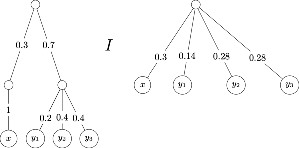

# Lotteries and Expected Utility

Suppose that $X$ is a finite set.  A **probability function** on $X$ is a function $p:X\rightarrow [0,1]$ such that $\sum_{x\in X} p(x)=1$.   If $S\subseteq X$, then $p(S)=\sum_{x\in S} p(x)$.[^f1]
[^f1]: There are a number of mathematical details about probability measures that we are glossing over here.  Our discussion in this section is greatly simplified since we assume that the set of objects $X$ is finite. 

In the remainder of this section, elements of $X$ are called *prizes*, or *outcomes*.   

Lottery
: Suppose that $Y=\{x_1,\ldots, x_n\}$ is a set of $n$ elements from $X$.   A lottery on $Y$ is denoted $[x_1:p_1,x_2:p_2,\ldots, x_n:p_n]$ where $\sum_{i=1}^n p_i=1$.    

We have defined lotteries for any subset of a fixed set $X$.   Without loss of generality, we can restrict attention to all lotteries on $X$.   For instance, suppose that $X=\{x_1,\ldots, x_n,y_1,\ldots, y_m\}$ and $L$ is a lottery on $Y=\{x_1,\ldots, x_n\}$.   That is, $L=[x_1:p_1,\ldots, x_n:p_n]$.   This lottery can be  extended to a lottery $L'$ over $X$ as follows: 

$$
L'=[x_1:p_1,\ldots, x_n:p_n, y_1:0,\ldots, y_m:0].
$$

Suppose that $X$ is a finite set and let $\mathcal{L}$ be the set of lotteries on  $X$. There are two technical issues that need to be addressed.   

1. We can identify elements $x\in X$ with lotteries $[x:1]$.    Thus, we may abuse notation and  say that "$X$ is contained in $\mathcal{L}$".  
2. We   need the notion of a compound lottery:  

Compound Lottery
: Suppose that $L_1, \ldots, L_n$ are lotteries. Then, $[L_1:p_1,\ldots, L_n:p_n]$ is **compound lottery**, where $\sum_{i=1}^n p_i=1$.
 

We are interested in decision makers that have preferences over the set of lotteries $\mathcal{L}$.  Suppose that $(P, I)$ is a rational preference  on $\mathcal{L}$.  We start by imposing the following axiom that will simplify our study of preferences over lotteries.

Axiom: Simplifying lotteries
:  Suppose that $(P, I)$ is a rational preference on $\mathcal{L}$ and that $[L_1:p_1,\ldots, L_n,p_n]$ is a compound lottery, where for each $i=1,\ldots, n$, we have $L_i=[x_1:p_1^i,\ldots, x_n:p_n^i]$.  Then, 

$$
[L_1:p_1,\ldots, L_n,p_n]\mathrel{I} [x_1:(p_1p_1^1+ p_2p_1^2 + \cdots p_np_1^n),\ldots, x_1:(p_1p_n^1+ p_2p_n^2 + \cdots p_np_n^n)]
$$   

This constraint on rational preferences over lotteries decision makers do not get any utility from the "thrill of gambling". That is, what matters to the decision maker is how likely she is to receive prizes that she prefers. 
For example, suppose that    $L_1=[x:1]$ and $L_2=[y_1:0.2, y_2:0.4, y_3:0.4]$.   Then, the decision maker is assumed to be indifferent between the compound lottery $L_3=[L_1:0.3, L_2:0.7]$ and the simple lottery $L_4=[x:0.3, y_1:0.14, y_2:0.28, y_3:0.28]$.   This can be pictured as follows: 

The goal is to show that any preference relation can be represented by a *linear* utility function:  

One way to compare lotteries is to assign a number of each lottery and rank the lotteries according to the number assigned to them.   That is, for a set of lotteries $\mathcal{L}$ and a function $V:\mathcal{L}\rightarrow\mathbb{R}$ assigning a real number of teach lottery, define the relation $R_V$ as follows: for all $L, L'\in \mathcal{L}$, $L\mathrel{R_V} L'$ if, and only if, $V(L)\ge V(L')$.  

One way to define a function $V:\mathcal{L}\rightarrow\mathbb{R}$ for the set of lotteries $\mathcal{L}$ on $X$ is to start with a utility function on the set of prizes $u:X\rightarrow\mathbb{R}$ and then  for each $L\in\mathcal{L}(X)$ define $V(L)$ as some function combining the probabilities in $L$ with the utility of the prizes in $L$. 

For example, let $u:X\rightarrow\mathbb{R}$ be a utility function on $X$.   The following are examples of different ways to assign a value to lotteries: 

1. $V_1:\mathcal{L}\rightarrow\mathbb{R}$ is the function where for each $L=[x_1:p_1,\ldots, x_n:p_n]$,  $V_1(L) = \min\{u(x_1), \ldots, u(x_n)\}$
1. $V_2:\mathcal{L}\rightarrow\mathbb{R}$ is the function where for each $L=[x_1:p_1,\ldots, x_n:p_n]$,  $V_2(L) = \sum_{i=1}^n u(x_i)$
1. $V_3:\mathcal{L}\rightarrow\mathbb{R}$ is the function where for each $L=[x_1:p_1,\ldots, x_n:p_n]$,   $V_3(L) = \sum_{i=1}^n p_i * u(x_i)$
1. $V_4:\mathcal{L}\rightarrow\mathbb{R}$ is the function where for each $L=[x_1:p_1,\ldots, x_n:p_n]$,   $V_4(L) = (\sum_{i=1}^n p_i * u(x_i)) + 0.2$
1. $V_5:\mathcal{L}\rightarrow\mathbb{R}$ is the function where for each $L=[x_1:p_1,\ldots, x_n:p_n]$,  $V_5(L) = (\sum_{i=1}^n p_i * 2 * u(x_i)) + 0.2$
1. $V_6:\mathcal{L}\rightarrow\mathbb{R}$ is the function where for each $L=[x_1:p_1,\ldots, x_n:p_n]$,  $V_6(L) = (\sum_{i=1}^n p_i * u(x_i))^4$
1. $V_7:\mathcal{L}\rightarrow\mathbb{R}$ is the function where for each $L=[x_1:p_1,\ldots, x_n:p_n]$,   $V_7(L) = (\sum_{i=1}^n p_i^2 * u(x_i))$

We can also define functions that treat sure-things different than other lotteries: Let $V_8:\mathcal{L}\rightarrow\mathbb{R}$ be  the function where: 

$V_8(L) = u(z)$ if $L$ is equivalent to $[z:1]$ for some $z\in X$  or $V_8(L) = 
\sum_{i=1}^n p_i u(x_i) + 0.2$   if $L=[x_1:p_1,\ldots, x_n:p_n]$ with at least two non-zero probabilities.

Note that function $V_3$ is the **expected utility** of lotteries with respect to the utility function $u$.  The key property of the expected utility valuation function is that it is linear: 

Linear Utility Function
: A utility function $u:\mathcal{L}\rightarrow \mathbb{R}$ is  **linear** provided for all $L=[L_1:p_1,\ldots, L_n:p_n]\in\mathcal{L}$, 

$$
u(L)=\sum_{i=1}^n p_i u(L_i)
$$

The functions $V_3, V_4$ and $V_5$ are all linear. 

